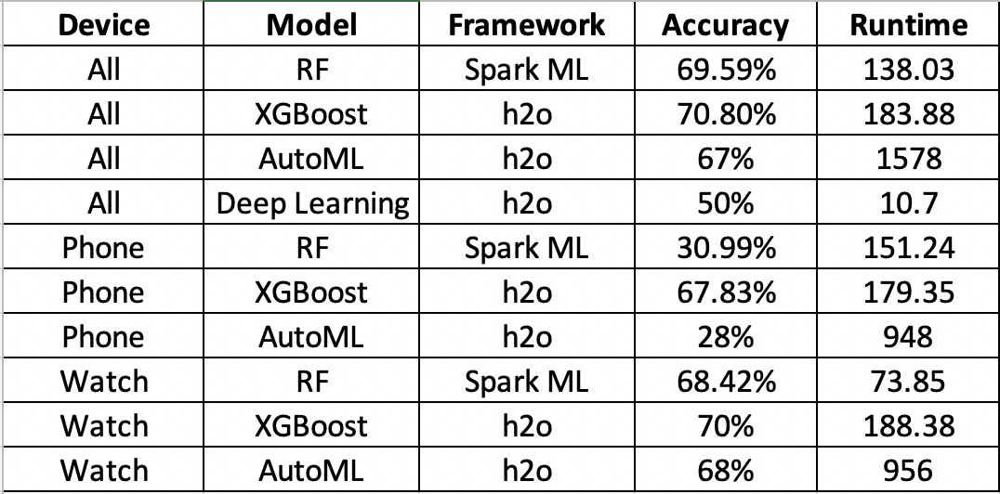
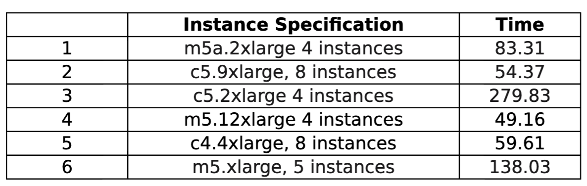

# Human Activity Recognition using Distributed Computing
​
## Technologies used:
​
    - Apache PySpark
    - Spark ML
    - H2O
    - AWS EMR
    - AWS S3
​

​
## Goal
Determine which device-meter combination is best at recognizing Human activities among the following available devices and sensors per device:
    - Devices: Phone, watch
    - Sensors: Accelerometer, Gyrometer
    
    
## Dataset
​
source : https://archive.ics.uci.edu/ml/datasets/WISDM+Smartphone+and+Smartwatch+Activity+and+Biometrics+Dataset+
​
Data (X,Y,Z coordinates) has been collected for 51 subjects for about 18 activities at a rate of 20Hz for 3 mins each:
​
    • Non hand-oriented:walking, jogging, stairs, standing, kicking 
    • Hand-oriented (G): dribbling, playing catch, typing, writing, clapping, brushing teeth, folding clothes
    • Hand-oriented (E): eating pasta, eating soup, eating sandwich, eating chips, drinking
    
2 devices & 2 sensor types :
​
    device : phone & watch  
    sensor : gyroscope & accelerometer 
    
Number or observations: 15630426
​
​
## Process
​
1) Data merged into one dataframe and stored to S3 bucket with the following columns:
user, device, sensor_type, activity, timestamp, x, y, z
​
2) Features extracted for each user-device-meter-activity combination:
mean(x), mean(y), mean(z), std(x), std(y), std(z), covariance(x,y), covariance(y,z), covariance(z,x), histogram(x,4), hostogram(y,4), histogram(z,4), range(x), range(y), range(z)
​
3) Fit 10 models on the extracted features with different device-sensor combinations and compared accuracies
​

​
​
4) Found XGBoost with all four sensors to be the best at classifying the activities, ran it on various AWS EMR cluster settings to compare runtimes
​

​
​
## Conclusions:
​
1) All four sensors together classify human activities best
​
2) XGBoost model using H2O gives the model with best accuracy (70%)
​
3) Hand-oriented sitting activities like eating pasta, soup, sandwich etc are the most difficult to correctly identify
​
​
## Description of Files

1) Preprocessing.ipynb - code used for preprocessing and feature extraction
2) modelling_notebooks - code for the 10 models fitted
3) visualization/preprocess_for_viz - preprocessing code used for generating time series and aggregate value visualizations of the various activities
4) visualization/visualizations on Plotly - code for generating time series and aggregate value visualizations of the various activities
 
